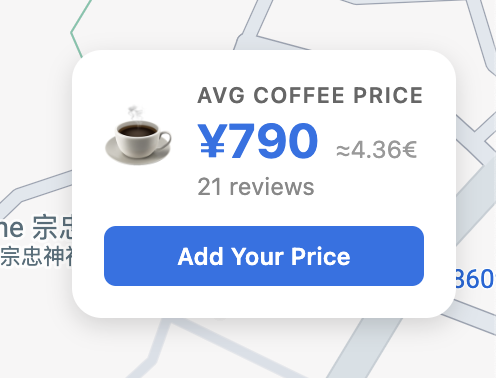
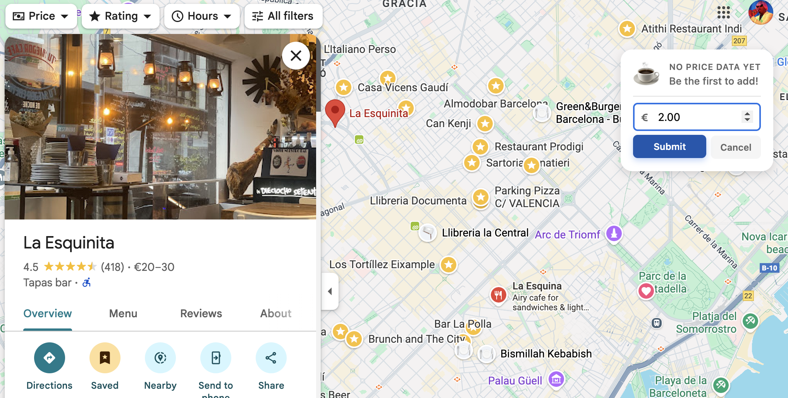
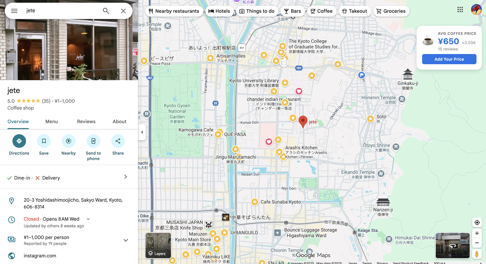

# ☕ How Much for a Cup of Joe?

A Chrome extension that tracks coffee prices across different cafés on Google Maps, helping you find the best deal for your daily caffeine.

## Overview

**How Much for A Cup of Joe?** is a browser extension that integrates with Google Maps to display and compare coffee prices from various establishments. This tool makes it easy to make informed decisions about where to get your next cup of Joe. This extension is community-based and so its service its just as good as its community, so please after drinking, review the price of the coffee you just enjoyed. 

## Features

- **Real-time Price Display**: View coffee prices directly on Google Maps listings
- **Seamless Integration**: Works naturally within the Google Maps interface
- **Quick Access**: Check prices without leaving your map search
- **User-Friendly Interface**: Clean, intuitive design that doesn't clutter your Maps experience
- **Multiple currencies**: Automatically changes per regional currency + provides exchange to euro or dollar.


## Installation

### From Chrome Web Store
Just search ['How much for a Cup of Joe?'](https://chromewebstore.google.com/detail/how-much-for-a-cup-of-joe/eekhlhcnjglbmhgdmknncpkmblngbmjg) and hit install
### Manual Installation (Development)
1. Clone this repository:
   ```bash
   git clone https://github.com/marinocom/CupOfJoe.git
   cd CupOfJoe
   ```

2. Open Chrome and navigate to `chrome://extensions/`

3. Enable "Developer mode" (toggle in the top-right corner)

4. Click "Load unpacked" and select the extension directory

5. The extension icon should now appear in your Chrome toolbar

## How to Use

1. **Navigate to Google Maps**: Open [Google Maps](https://maps.google.com) in your Chrome browser

2. **Search for Coffee**: Search for coffee shops, cafés, or specific establishments in your area

3. **View Prices**: Coffee prices will automatically appear on the map listings where available, if no price appears, be the first to add one yourself!

4. **Compare**: Browse through different locations to find the best prices

5. **Add price**: After having coffee please use the add price function, to add the price and let everyone know How much for a Cup of Joe?

### Examples



*See average coffee prices directly on Google Maps listings with automatic currency conversion*

**Add Your Price**



*Contribute to the community by adding prices after your coffee visit*

**Compare Across Cafés**



*Browse and compare prices across different coffee shops in your area*


### Stack

- **JavaScript**: Core functionality and Google Maps API integration
- **Chrome Extension APIs**: Browser extension framework
- **HTML/CSS**: User interface and styling
- **Manifest V3**: Chrome extension platform
- **PostgreSQL**: Database creation and handling platform

### Project Structure

```
CupOfJoe/
├── manifest.json         # Extension configuration
├── How much for a Cup of Joe?/
│   ├── content.js        # Content script for Maps integration
│   ├── background.js     # Background service worker
│   ├── content.css       # Styling 
│   ├── popup.js          # Popup script 
│   └── popup.html        # Extension popup interface
├── icons/                # Extension icons 
└── README.md
```


### 🤝 Contributing

Contributions are welcome! If you'd like to improve the extension:

1. Fork the repository
2. Create a feature branch (`git checkout -b feature/CoolCoffeeRelatedFeature`)
3. Commit your changes (`git commit -m 'Add some CoolerCoffeeRelatedFeature'`)
4. Push to the branch (`git push origin feature/CoolestRelatedFeature`)
5. Open a Pull Request

### Ideas for Contributions
- Add support for different coffee types (espresso, latte, cappuccino, etc.)
- Implement price history tracking, stock-style diagram
- Add user reviews and ratings integration
- Expand to other map services, Didi maps?

###  License

This project is licensed under the MIT License - see the [LICENSE](LICENSE) file for details.


##  👤 Author

**Marino Oliveros Blanco**
- GitHub: [marinocom](https://github.com/marinocom)
- LinkedIn: [Marino O.](https://www.linkedin.com/in/marino-o-3a6b171b9)

Have questions, suggestions, or café recommendations? Feel free to open an issue or reach out! -> marino.oliverosblanco@gmail.com

### Background

This project was created during my time as a student in Kyoto University, where the most important thing about the coffee was how much ¥ it was going to set me back. Also can we agree, aren't coffee prices going a bit too far these days?

### Acknowledgements

Special thanks to [Paul Anderson](https://github.com/nightcrab), who apart from being a great friend, is also a very good programmer and helped greatly with this project.

**Made with ☕ and ❤️ in Kyoto**
